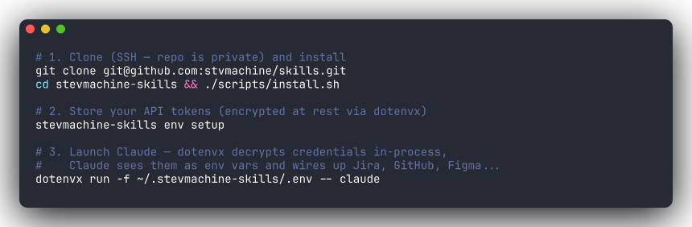

# Stevmachine Skills

A minimal distribution system for Stevmachine [skills](https://docs.claude.com/en/docs/claude-code/skills) and [MCP servers](https://modelcontextprotocol.io) in Claude Code, with credentials backed by [dotenvx](https://github.com/dotenvx/dotenvx).


The whole tool does three things:

1. Copies skill packages to `~/.claude/skills/`.
2. Merges each skill's MCP server config into `~/.claude/.mcp.json` — keeping `${VAR}` references literal, not resolved values.
3. Manages an encrypted `.env` at `~/.stevmachine-skills/` (with keys in `.env.keys`) that supplies those vars when you launch Claude Code under `dotenvx run`.

## Quick Start

> **Note:** this is a public repo. The install path is **clone + build**, not a `curl | bash` or `go install` flow.

Prereqs: [Go](https://go.dev/dl/), Node.js (for `dotenvx`), and Claude Code (`npm install -g @anthropic-ai/claude-code`).

```bash
git clone git@github.com:stvmachine/skills.git
cd stevmachine-skills

# Build the CLI into a directory on your PATH
go build -o ~/.local/bin/stevmachine-skills ./cmd/stevmachine-skills
# (or anywhere on PATH: /usr/local/bin, /opt/homebrew/bin, etc.)

# Copy skill packages to ~/.claude/skills/ + write ~/.claude/.mcp.json
stevmachine-skills install

# Interactive credential setup
stevmachine-skills env setup
```



If you'd rather not put the binary on PATH, every `stevmachine-skills <cmd>` line below is equivalent to `go run ./cmd/stevmachine-skills <cmd>` from inside the repo.

## CLI

```bash
stevmachine-skills install [SKILL ...]   # copy skills + write .mcp.json (defaults to all)
stevmachine-skills list                  # list installed skills
stevmachine-skills doctor                # check Claude Code / dotenvx / vault state

stevmachine-skills env set KEY VALUE     # store an encrypted variable
stevmachine-skills env list              # show variables (masked)
stevmachine-skills env encrypt           # encrypt .env
stevmachine-skills env decrypt           # decrypt .env (don't leave it sitting)
stevmachine-skills env rotate            # rotate the encryption key
stevmachine-skills env setup             # interactive TUI wizxxard

# All env commands take --environment/-e for per-env files (e.g. .env.production)
```

## Credential Management

Secrets live encrypted in `~/.stevmachine-skills/.env` (ciphertext) with decryption keys in `~/.stevmachine-skills/.env.keys`. This is the sole store — no OS keychain, no plaintext fallback. See [docs/ADR-001-dotenvx.md](docs/ADR-001-dotenvx.md) for the rationale.

Use the interactive wizard for first-time setup:

```bash
stevmachine-skills env setup
```

Or set variables manually:

```bash
stevmachine-skills env set JIRA_HOST https://yourcompany.atlassian.net
stevmachine-skills env set JIRA_USERNAME you@example.com
stevmachine-skills env set JIRA_API_TOKEN <token>
```

### Supported MCP Servers

| Server | Required Env Vars |
|---|---|
| Jira (mcp-atlassian) | `JIRA_HOST`, `JIRA_USERNAME`, `JIRA_API_TOKEN` |
| GitHub | `GITHUB_TOKEN` |
| Confluence | `CONFLUENCE_URL`, `CONFLUENCE_USERNAME`, `CONFLUENCE_API_TOKEN` |
| Figma | `FIGMA_ACCESS_TOKEN` |

### Generated `.mcp.json`

The generated `~/.claude/.mcp.json` stores only `${VAR}` references. Claude Code expands them from its process env at MCP server startup.


```json
{
  "mcpServers": {
    "mcp-atlassian": {
      "command": "npx",
      "args": ["-y", "@modelcontextprotocol/server-atlassian"],
      "env": {
        "JIRA_HOST": "${JIRA_HOST}",
        "JIRA_USERNAME": "${JIRA_USERNAME}",
        "JIRA_API_TOKEN": "${JIRA_API_TOKEN}"
      }
    }
  }
}
```

## Launching Claude Code

`claude` must be started with the vault's variables already in its env. The canonical command:

```bash
dotenvx run -f ~/.stevmachine-skills/.env -- claude
```

`dotenvx run` decrypts the vault in memory using `~/.stevmachine-skills/.env.keys`, injects values into the `claude` child process env, and exits. No plaintext is ever written to disk.

### Wrapping `claude`

Typing the full command every time is tedious. Pick one.

**Shell function — `fish`** (`~/.config/fish/functions/claude.fish`):

```fish
function claude --description 'Run claude with stevmachine vault decrypted'
    dotenvx run -f $HOME/.stevmachine-skills/.env -- command claude $argv
end
```

**Shell function — `bash` / `zsh`** (in `~/.bashrc` or `~/.zshrc`):

```bash
claude() {
  dotenvx run -f "$HOME/.stevmachine-skills/.env" -- command claude "$@"
}
```

`command claude` bypasses the function recursion and calls the real binary. Reload with `exec $SHELL -l`.

**PATH wrapper** (works for GUI / IDE launches, not just terminal). Save as `~/.local/bin/claude`, `chmod +x`, and ensure `~/.local/bin` is ahead of the real binary's directory in `PATH`:

```bash
#!/usr/bin/env bash
set -euo pipefail
REAL_CLAUDE="$(PATH="${PATH#*$HOME/.local/bin:}" command -v claude)"
exec dotenvx run -f "$HOME/.stevmachine-skills/.env" -- "$REAL_CLAUDE" "$@"
```

**Per-environment vaults**: parameterize the wrapper with `STEVMACHINE_VAULT`:

```bash
claude() {
  local vault="${STEVMACHINE_VAULT:-$HOME/.stevmachine-skills/.env}"
  dotenvx run -f "$vault" -- command claude "$@"
}
```

Then `STEVMACHINE_VAULT=~/.stevmachine-skills/.env.production claude`.

## Available Skills

| Skill | Description |
|---|---|
| `stevmachine-jira` | Jira ticket workflow via mcp-atlassian |
| `stevmachine-jira-markup` | Jira comment formatting helper |
| `stevmachine-jira-ticket-transition` | Advance a ticket — `qa` (ship to QA) or `review` (send for peer review). PR + Jira transition + bead update. |
| `commit` | Conventional commits with gitmoji |
| `run-stevmachine-skills` | Build, run, and smoke-test this CLI (developer tool — drives the `env setup` wizard via tmux) |

## Architecture

Three Go packages:

- `internal/vault` — wraps the `dotenvx` CLI.
- `internal/mcp` — parses skill `SKILL.md` frontmatter and writes `~/.claude/.mcp.json`.
- `cmd/stevmachine-skills` — CLI entry point with `flag`-based subcommands.

Skill packages are embedded into the binary via `//go:embed` so `stevmachine-skills install` works without the repo cloned.

## Security

- ECIES (secp256k1 + AES-256-GCM) via dotenvx.
- `.env` is encrypted and safe to commit. `.env.keys` is local-only.
- `~/.stevmachine-skills/` has `chmod 700`.
- `.mcp.json` never contains resolved secrets — only `${VAR}` references.

## Development

```bash
go build ./cmd/stevmachine-skills
go test ./...
```

## License

MIT
